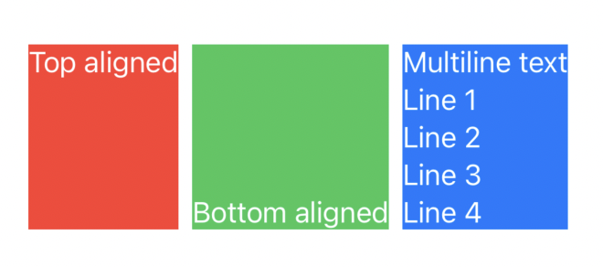
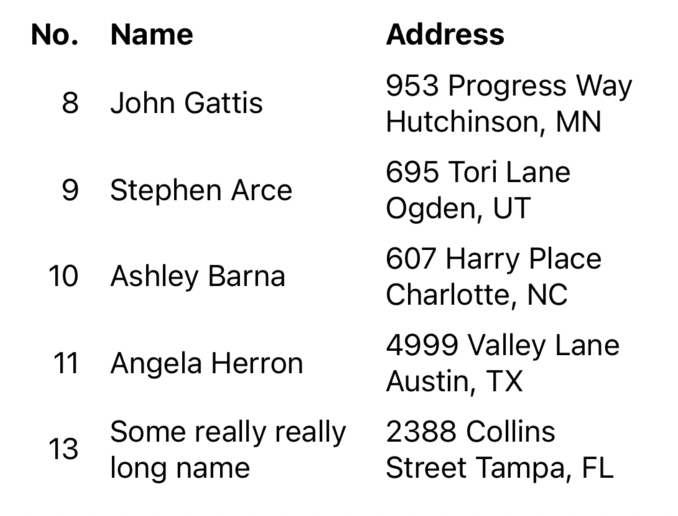
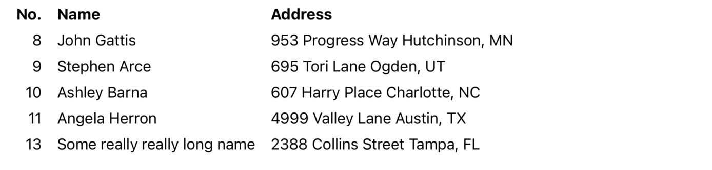
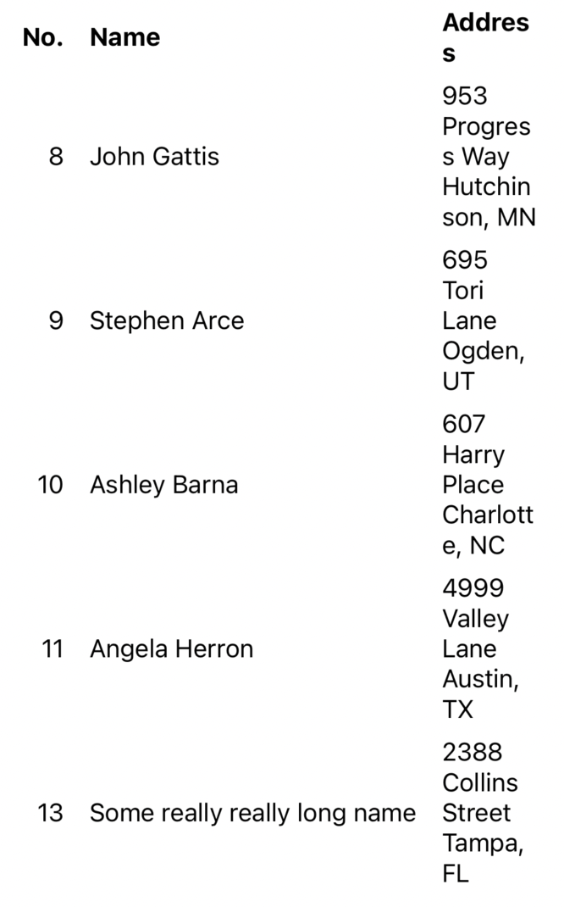
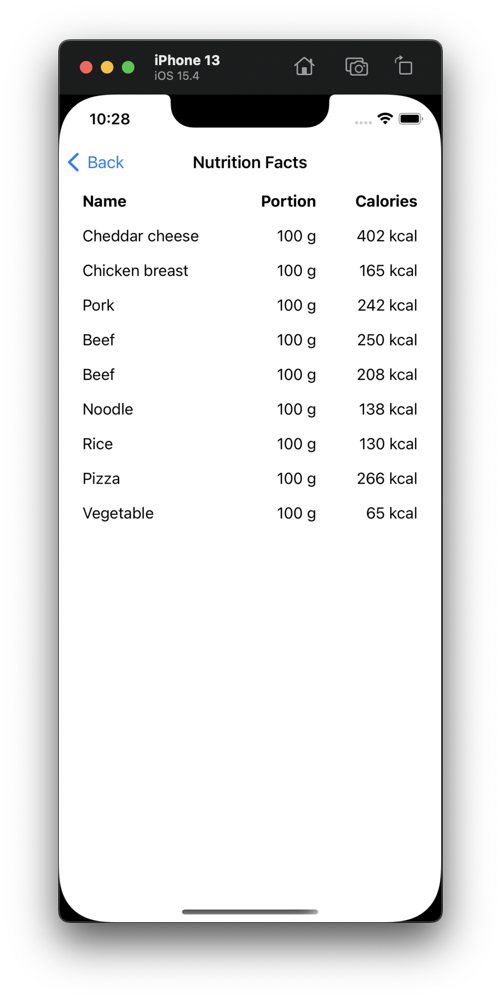
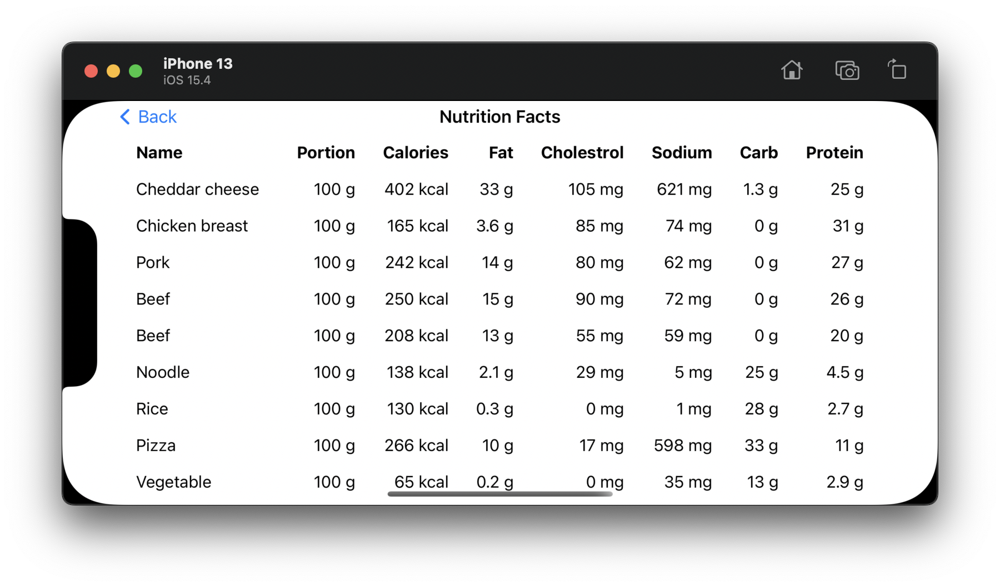

<p>
  <a href="https://github.com/vinceplusplus/measurement-reader/actions?query=workflow%3Atest+event%3Apush">
    
  </a>
  <a href="https://codecov.io/gh/vinceplusplus/measurement-reader">
    
  </a>
</p>

# measurement-reader

`measurement-reader` is a collection of views to measure one or more views with the use of a proxy. The idea was inspired by https://stackoverflow.com/a/65619921

- [Installation](#installation)
- [Usage](#usage)
  - [`SimpleSizeReader`](#simplesizereader)
  - [`SimpleMeasurementReader`](#simplemeasurementreader)
  - [`SimpleTableReader`](#simpletablereader)
- [Reference](#reference)
  - [`SimpleSizeReader`](#simplesizereader-1)
  - [`SizeReader`](#sizereader)
  - [`SimpleMeasurementReader`](#simplemeasurementreader-1)
  - [`MeasurementReader`](#measurementreader)
  - [`SimpleTableReader`](#simpletablereader-1)
  - [`TableReader`](#tablereader)
  - [`version`](#version)
  - [`MeasurementReducer`](#measurementreducer)
  - [`MeasurementProxy`](#measurementproxy)
  - [`TableProxy`](#tableproxy)
- [Examples](#examples)
- [Additional Notes](#additional-notes)
  - [`Warnings during orientation change`](#warnings-during-orientation-change)

## Installation

To install through Xcode, follow the [official guide](https://developer.apple.com/documentation/xcode/adding_package_dependencies_to_your_app) to add the following your Xcode project
```
https://github.com/vinceplusplus/measurement-reader
```

To install through Swift Package Manager, add the following as package dependency and target dependency respectively
```
.package(url: "https://github.com/vinceplusplus/measurement-reader.git", from: "2.1.1")
```
```
.product(name: "MeasurementReader", package: "measurement-reader")
```

## Usage

### `SimpleSizeReader`

To measure the max height and apply back to multiple views, `SimpleSizeReader` could be used



```swift
import MeasurementReader

// ...

SimpleSizeReader { proxy in
  HStack {
    VStack {
      Text("Top aligned")
        .measure(proxy)                                         // measure
    }
    .frame(minHeight: proxy.maxHeight(), alignment: .top)       // apply back
    .background(Color.red)
    
    VStack {
      Text("Bottom aligned")
        .measure(proxy)                                         // measure
    }
    .frame(minHeight: proxy.maxHeight(), alignment: .bottom)    // apply back
    .background(Color.green)

    VStack {
      Text("Multiline text\nLine 1\nLine 2\nLine 3\nLine 4")
        .measure(proxy)                                         // measure
    }
    .frame(minHeight: proxy.maxHeight())                        // apply back
    .background(Color.blue)
  }
  .foregroundColor(Color.white)
}
```

- `.measure(proxy)` to measure the dimensions of the view
- `proxy.maxHeight()` to get the max height of the aggregated measurements
- The extra `VStack` is more for clarity to show that framing should happen after measurement
- Using `minHeight` so that it starts with `nil` to allow the actual content view to expand as much as the layout allows
- Ideally the rendering takes 2 passes
  - First pass to measure
  - Second pass to apply the max height
  - Second pass will still measure but since the measurement result is the same as the first one, no changes will be made so no more rendering passes
  - Internally, it uses the preference key technique

### `SimpleMeasurementReader`

While `SimpleSizeReader` can only measure only a single group of views,
`SimpleMeasurementReader` can do for multiple groups of views



```swift
fileprivate enum Field {
  case no
  case name
  case address
}

// ...

return SimpleMeasurementReader<Field> { proxy in
  VStack(spacing: 8) {
    ForEach(data, id: \.no) { person in
      HStack(spacing: 16) {
        VStack {
          Text("\(person.no)")
            .measure(proxy, .no)                                      // measure
        }
        .frame(minWidth: proxy.maxWidth(.no), alignment: .trailing)   // apply back
        
        VStack {
          Text("\(person.name)")
            .measure(proxy, .name)                                    // measure
        }
        .frame(minWidth: proxy.maxWidth(.name), alignment: .leading)  // apply back
        
        Text("\(person.address)")
          .frame(maxWidth: .infinity, alignment: .leading)
      }
      .font(person.no == "No." ? .system(size: 16, weight: .bold) : .system(size: 16))
    }
  }
}
```

- `SimpleMeasurementReader<Field>` to measure different groups identified by `Field`
- `.measure(proxy, .no)`, etc to measure a certain group identified by the 2nd parameter
- `proxy.maxWidth(.no)`, etc to get back the max width of the group identified by the 1st parameter  

In some circumstances, using `minWidth` (or `minHeight`) might cause weird layout or
unexpected layout overflow. Take the above example, if we rotate the device into landscape mode,
we get



The `Some really really long name` can now fit in one line, in fact, each of the texts can be fitted in one line.
If we rotate the device back into portrait mode, we get



Not quite what we would have expected. The problem is that, when the first measurements were being done,
it didn't force any `minWidth` but allowed the system to lay out with best efforts. Then we got some stable
non-nil `minWidth` enforcements. In the landscape mode, the `minWidth` enforcements were extended further. And since
we don't control the last field but allow it to take the rest of the space, hence, when we got back into
the portrait mode, we got only a tiny fraction of the width to render the last field

If we did control the last field, it would result in layout overflow, i.e. got clipped in both ends horizontally

The fix would be to allow the measurements to be done again without previous measurements to be applied to
`minWidth`. We could do so with the `version` parameter. When a new `version` is used, `proxy` will forgo
previous measurements so that would allow `minWidth` to start with `nil` again

```swift
return SimpleSizeReader { containerProxy in           // use a separate `SizeReader`
  VStack(spacing: 0) {
    Color.clear
      .frame(height: 0)
      .measure(containerProxy)                  // to measure the available width
    
    SimpleMeasurementReader<Field>(
      version: containerProxy.maxWidth()        // version with available width
    ) { proxy in
      VStack(spacing: 8) {
        ForEach(data, id: \.no) { person in
          HStack(spacing: 16) {
            VStack {
              Text("\(person.no)")
                .measure(proxy, .no)
            }
            .frame(minWidth: proxy.maxWidth(.no), alignment: .trailing)
            
            VStack {
              Text("\(person.name)")
                .measure(proxy, .name)
            }
            .frame(minWidth: proxy.maxWidth(.name), alignment: .leading)
            
            Text("\(person.address)")
              .frame(maxWidth: .infinity, alignment: .leading)
          }
          .font(person.no == "No." ? .system(size: 16, weight: .bold) : .system(size: 16))
        }
      }
    }
  }
}
```


The result is the same as when the above example was first run in portrait mode. Using `GeometryReader`
in place of `SimpleSizeReader` will work too, but here we are just demonstrating the versatility of the library

### `SimpleTableReader`

`SimpleTableReader` can be used to handle table layout. When the avaiable width is larger
than necessary, padding (by default) could be applied to fill the rest of the available width.
When smaller, fields can progressively be shrunk to meet the available width requirement

To achieve the following layouts in both portrait and landscape (more fields) modes respectively




```swift
return SimpleSizeReader { containerProxy in
  VStack(spacing: 0) {
    Color.clear
      .frame(height: 0)
      .measure(containerProxy)
    
    ScrollView {
      SimpleTableReader<Field>(
        maxWidth: (containerProxy.maxWidth() ?? 0) - 16 * 2,  // minus horizontal padding
        version: containerProxy.maxWidth()
      ) { proxy in
        VStack(spacing: 0) {
          ForEach(data, id: \.id) { food in
            HStack(spacing: 0) {
              VStack {
                Text("\(food.name)")
                  .padding(.horizontal, 8)
                  .measure(proxy, .name)
              }
              .frame(minWidth: proxy.columnWidth(.name), alignment: .leading)
              
              VStack {
                Text("\(food.portion)")
                  .padding(.horizontal, 8)
                  .measure(proxy, .portion)
              }
              .frame(minWidth: proxy.columnWidth(.portion), alignment: .trailing)
              
              VStack {
                Text("\(food.calories)")
                  .padding(.horizontal, 8)
                  .measure(proxy, .calories)
              }
              .frame(minWidth: proxy.columnWidth(.calories), alignment: .trailing)
              
              if horizontalSizeClass == .regular || deviceOrientation.isLandscape {
                VStack {
                  Text("\(food.fat)")
                    .padding(.horizontal, 8)
                    .measure(proxy, .fat)
                }
                .frame(minWidth: proxy.columnWidth(.fat), alignment: .trailing)
                
                // ...
              }
            }
            .font(food.id == "ID" ? .system(size: 16, weight: .bold) : .system(size: 16))
            .padding(.vertical, 8)
          }
        }
        .padding(.horizontal, 16)
      }
    }
    .frame(maxWidth: .infinity, maxHeight: .infinity)
  }
}
```

- The `SimpleSizeReader` is for determining what width we can allocate to the table, `GeometryReader` could be used instead though
- Some arithmetic needs to be carried out to account for things like padding and spacing
- `version: containerProxy.maxWidth()` so the measurements of the extra fields in landscape mode won't stay to affect portrait layout
- `proxy.columnWidth(.name)`, etc to get column width, `.maxWidth(...)`, `.maxHeight(...)`, `.maxSize(...)`, etc are still available though

## Reference

### `SimpleSizeReader`

A view to measure one group of views

```swift
SimpleSizeReader(version: ..., reducer: ...) { proxy in
  ...
}
```

- `version`, [version](#version), the default is `DefaultMeasurementVersion()`
- `reducer`, [MeasurementReducer](#measurementreducer), the default is `.replace`
- `proxy`, [MeasurementProxy](#measurementproxy)

### `SizeReader`

Similar to `SimpleSizeReader` but takes a `Scope` type. A uniquely given `Scope` will help making sure the perference key value will only concern the said scope 

```swift
SizeReader(version: ..., reducer: ...) { proxy in
  ...
}
```

- `version`, [version](#version), the default is `DefaultMeasurementVersion()`
- `reducer`, [MeasurementReducer](#measurementreducer), the default is `.replace`
- `proxy`, [MeasurementProxy](#measurementproxy)

### `SimpleMeasurementReader`

A view to measure multiple groups of views 

```swift
SimpleMeasurementReader<Tag>(version: ..., reducer: ...) { proxy in
  ...
}
```

- `Tag`, a user given tag type to differentiate different groups to measure
- `version`, [version](#version), the default is `DefaultMeasurementVersion()`
- `reducer`, [MeasurementReducer](#measurementreducer), the default is `.replace`
- `proxy`, [MeasurementProxy](#measurementproxy)
- uses `MeasurementReader` under the hood

### `MeasurementReader`

```swift
MeasurementReader<Scope, Tag>(version: ..., reducer: ...) { proxy in
  ...
}
```

- `Scope`, a user given scope type to further identify the measurement view 
- `Tag`, a user given tag type to differentiate different groups to measure
- `version`, [version](#version), the default is `DefaultMeasurementVersion()`
- `reducer`, [MeasurementReducer](#measurementreducer), the default is `.replace`
- `proxy`, [MeasurementProxy](#measurementproxy)

### `SimpleTableReader`

Table layout view

```swift
SimpleTableReader<Tag>(maxWidth: ..., pads: ..., version: ..., reducer: ...) { proxy in
  ...
}
```

- `Tag`, a user given tag type to differentiate different groups to measure
- `maxWidth`, the max width allowed
- `pads`, pads or not if required width less than `maxWidth`, the default is `true`
- `version`, [version](#version), the default is `DefaultMeasurementVersion()`
- `reducer`, [MeasurementReducer](#measurementreducer), the default is `.merge`
- `proxy`, [TableProxy](#tableproxy)

### `TableReader`

Similar to `SimpleTableReader` but takes a `Scope` type

```swift
TableReader<Scope, Tag>(maxWidth: ..., pads: ..., version: ..., reducer: ...) { proxy in
  ...
}
```

- `Scope`, a user given scope type to further identify the measurement view 
- `Tag`, a user given tag type to differentiate different groups to measure
- `maxWidth`, the max width allowed
- `pads`, pads or not if required width less than `maxWidth`, the default is `true`
- `version`, [version](#version), the default is `DefaultMeasurementVersion()`
- `reducer`, [MeasurementReducer](#measurementreducer), the default is `.merge`
- `proxy`, [TableProxy](#tableproxy)

### `version`

Any `AnyHashable`, e.g. `1`, `2`, `"abc"`, `"xyz"`, ...

### `MeasurementReducer`

- `.replace`, replaces with measurements being done this pass
- `.reducer`, merges previous measurements with measurements being done this pass

### `MeasurementProxy`

- `.maxSize(...)`, get the max size
- `.maxWidth(...)`, get the max width
- `.maxHeight(...)`, get the max height

### `TableProxy`

- `.columnWidth(...)`, get the column width
- `.maxSize(...)`, get the max size
- `.maxWidth(...)`, get the max width
- `.maxHeight(...)`, get the max height

## Examples

`Exapmles/Example` is an example app that demonstrate how to use `measurement-reader`

## Additional Notes

### Warnings during orientation change

Sometimes you might get something like the following

```
Bound preference ScopedMeasurementPreferenceKey<ScopeChain<AutoScope19, Unscoped>, Field> tried to update multiple times per frame.
```

If the layout is complicated, getting a stable layout during orientation change might actually require
more than a few passes, hence the warnings. Try using `TableReader` or `SimpleTableReader` (which has logic
to distribute horizontal space in one go) if appropriate to see if the warnings go away
